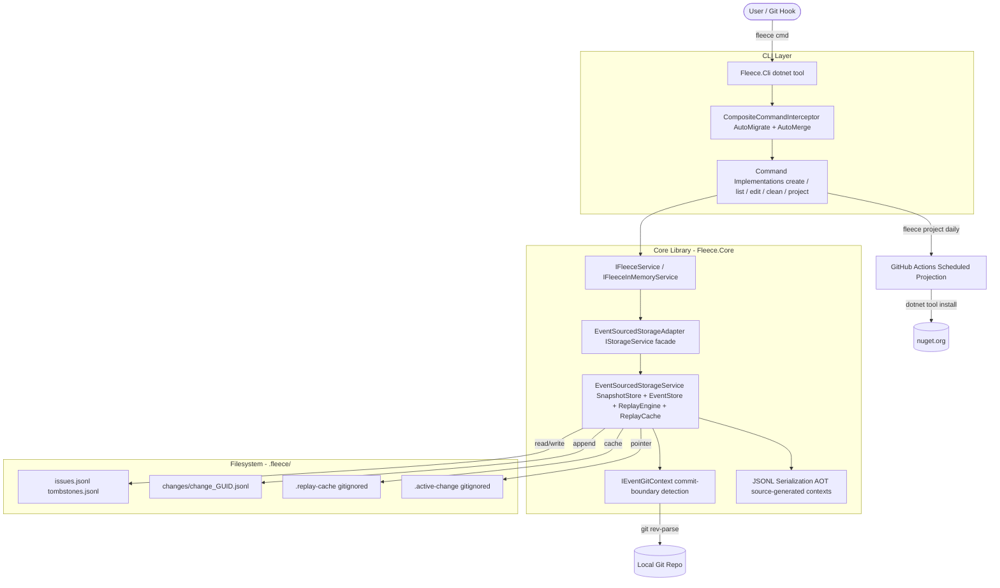

# System Architecture

**Project**: Fleece
**Architecture Pattern**: Layered — Event-Sourced Storage + Functional Core + CLI Shell
**Last Updated**: 2026-06-04

## High-Level Architecture

## Component Architecture

### CLI Layer (`src/Fleece.Cli/`)
**Purpose**: Thin command-dispatch wrapper over Fleece.Core. No business logic.
**Location**: [`src/Fleece.Cli/Commands/`], [`src/Fleece.Cli/Settings/`]
**Responsibilities**:
- Parse CLI flags via Spectre.Console.Cli
- Run `CompositeCommandInterceptor` (AutoMigrate, AutoMerge) before every command
- Format output via `TableFormatter`, `TreeRenderer`, `TaskGraphRenderer`, `JsonFormatter`

**Dependencies**:
- Internal: `Fleece.Core` (all services via DI)
- External: `Spectre.Console.Cli`, `Microsoft.Extensions.DependencyInjection`

### Application Service Layer (`src/Fleece.Core/Services/`)
**Purpose**: Unified domain operations. `FleeceService` is the primary API facade.
**Key Pattern**: Functional Core / Imperative Shell — load state, delegate to pure functions, persist
**Configuration**: `ISettingsService` merges `~/.fleece/settings.json` (global) + `.fleece/settings.json` (local)

### Storage Adapter Layer
**Purpose**: Bridges legacy `IStorageService` API to event-sourced backend.
**Component**: `EventSourcedStorageAdapter` implements `IStorageService` over `IEventSourcedStorageService`
**Write path**: Diffs old vs new state, emits granular events (`create`/`set`/`add`/`remove`/`hard-delete`)

### Event-Sourcing Infrastructure (`src/Fleece.Core/EventSourcing/`)
**Purpose**: Snapshot store, event store, DAG-ordered replay engine, replay cache, link service, migration service.
**Key Invariant**: Change files are immutable once committed to git — `EventStore.ResolveActiveOrRotateAsync` rotates to a fresh GUID when `IEventGitContext.IsFileCommittedAtHead` returns true.

### Git Context Layer
**Purpose**: Detects commit boundaries for change-file rotation. `NullEventGitContext` for non-git environments.
**Components**: [`GitEventContext.cs`], [`NullEventGitContext.cs`], [`GitService.cs`]

### Serialization Layer (`src/Fleece.Core/Serialization/`)
**Purpose**: AOT-safe JSONL serialization via System.Text.Json source-gen contexts.
**Components**: `FleeceJsonContext`, `EventSourcingJsonContext`, `JsonlSerializer`

## Data Flow

### Command Execution
1. User invokes `fleece <cmd>` → `CliApp.RunAsync`
2. Spectre.Console.Cli routes to registered command type via DI (`TypeRegistrar`)
3. `CompositeCommandInterceptor` runs: `AutoMigrateInterceptor` checks migration need, `AutoMergeInterceptor` checks autoMerge setting
4. `Command.ExecuteAsync` calls `IFleeceService` or `IFleeceInMemoryService` methods
5. Results formatted via Spectre.Console and written to stdout

### Issue Read (event-sourced)
1. `IStorageService.GetAllAsync` called via `EventSourcedStorageAdapter`
2. `EventSourcedStorageService` checks `ReplayCache` for current HEAD SHA
3. **Cache miss**: `SnapshotStore` loads `issues.jsonl` baseline; `ReplayEngine` walks follows-DAG in topological order
4. **Cache hit**: Load committed state from cache; replay only uncommitted change files on top
5. Projected issue set returned and cached at HEAD SHA

### Issue Write (event-sourced)
1. `IStorageService.SaveAllAsync` called via `EventSourcedStorageAdapter`
2. Adapter diffs old vs new state to produce change events
3. `EventStore.ResolveActiveOrRotateAsync` checks if active file is committed at HEAD; rotates to new GUID if so
4. Events appended to `change_{guid}.jsonl`; `.active-change` pointer updated

### Snapshot Compaction (`fleece project`)
1. `ProjectCommand` invoked (only on configured default branch)
2. Full replay over all change files
3. 30-day auto-cleanup for soft-deleted issues applied
4. Fresh `issues.jsonl` and `tombstones.jsonl` written; all `.fleece/changes/` files deleted and result staged

### Merge Topology Capture
1. Git `pre-merge-commit` or `pre-commit` hook (installed by `fleece install`) fires
2. `fleece link --merge` identifies DAG leaves on HEAD and each MERGE_HEAD
3. Writes `change_link_{guid}.jsonl` with multi-parent `follows` array
4. Merge marker committed alongside the merge commit

## Integration Points

### External Services
- **GitHub Actions CI** (`.github/workflows/ci.yml`): Build + 4 test suites + smoke test on push/PR
- **GitHub Actions Release** (`.github/workflows/release.yml`): Pack and publish NuGet packages on `v*.*.*` tags
- **GitHub Actions Scheduled Projection** (`.github/workflows/fleece-project.yml`): Daily `fleece project` compaction at 06:00 UTC
- **NuGet (nuget.org)**: Distribution — `Fleece.Cli` as dotnet tool, `Fleece.Core` as library

### Internal Communication
- **Service-to-Service**: Constructor injection via `IServiceCollection`; `AddFleeceCore` extension registers all services
- **Event-Driven**: `IIssueSerializationQueue` for background persistence in the in-memory cache layer
- **Git Integration**: `IGitService` / `GitService` for staging, commit detection, and hook invocation

## Performance Considerations

### Caching Strategy
- `ReplayCache` persists projected state keyed by HEAD SHA — committed file replay paid once per HEAD advancement
- `FleeceInMemoryService` holds full issue set in `ConcurrentDictionary`; `FileSystemWatcher` with 500ms debounce for external-change invalidation

### Bottlenecks
- Full DAG replay triggered on cache miss (first run, or after `git reset`) — cost proportional to change file count
- `fleece project` is a batch operation but is expected to run daily from CI, not per-command

## Deployment Architecture

### Distribution
- **Type**: dotnet global tool (`dotnet tool install --global Fleece.Cli`)
- **Target Framework**: `net10.0`; `Fleece.Core` is `IsAotCompatible=true`
- **Versioning**: Semantic versioning via `v*.*.*` git tags; version injected at pack time

### Environments
- **Developer machine**: Primary runtime; `.fleece/` committed alongside code
- **CI (GitHub Actions)**: Daily compaction via installed workflow template
- **Non-git environment**: `NullEventGitContext` disables rotation; `Fleece.Core` fully usable as library

## Cross-References
- **Domain entities**: See [concept_map.md](concept_map.md)
- **Module breakdown**: See [modules.md](modules.md)
- **CLI interaction**: See [interaction-model.md](interaction-model.md)
- **Code patterns**: See [patterns.md](patterns.md)
