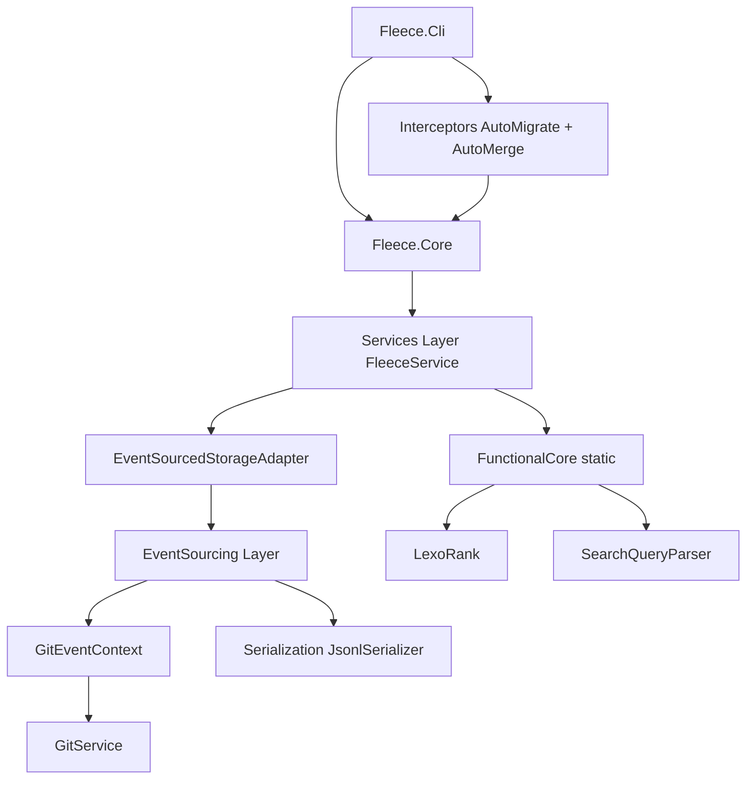

# Module & Component Breakdown

**Project**: Fleece
**Analysis Date**: 2026-06-04
**Modules Analyzed**: 7 top-level, 28+ components

## Core Modules

### Fleece.Core (`src/Fleece.Core/`)
**Purpose**: Library with all business logic, storage, event-sourcing, and domain models. Designed for external consumption by CLI and external tools (e.g., Homespun).
**Complexity**: High
**Files**: ~118 | **Lines**: ~13,400 | **AOT-compatible**: yes (`IsAotCompatible=true`)

### Fleece.Core/Services (`src/Fleece.Core/Services/`)
**Purpose**: Top-level service implementations — `FleeceService` facade, in-memory cache, storage adapters, git integration, settings, diff utilities, and graph layout.
**Key Components**:
- **`FleeceService`** (`Services/FleeceService.cs`): Unified `IFleeceService` facade. Load → pure function → persist. `SemaphoreSlim(1,1)` for writes. Partial ID resolution, tag validation, 10-attempt ID collision avoidance.
- **`FleeceInMemoryService`** (`Services/FleeceInMemoryService.cs`): `ConcurrentDictionary` cache over `FleeceService`. `FileSystemWatcher` with 500ms debounce. Write-through + `IIssueSerializationQueue` background persistence.
- **`EventSourcedStorageAdapter`** (`Services/EventSourcedStorageAdapter.cs`): Implements legacy `IStorageService` over `IEventSourcedStorageService`. Diffs old vs new state on write to emit granular events.
- **`GitService`** (`Services/GitService.cs`): Shell wrapper for git — availability check, repo detection, staging `.fleece/`, arbitrary git command execution.
- **`GitConfigService`** (`Services/GitConfigService.cs`): Resolves user identity — `FleeceSettings.Identity` override first, then `git config user.name`.
- **`SettingsService`** (`Services/SettingsService.cs`): Merges global (`~/.fleece/settings.json`) + local (`.fleece/settings.json`). Local overrides global.
- **`GraphLayoutService`** (`Services/GraphLayout/GraphLayoutService.cs`): Generic layout engine — `IssueGraph` (leaf-upward) and `NormalTree` (parent-first DFS) modes. Cycle detection.
- **`IssueLayoutService`** (`Services/GraphLayout/IssueLayoutService.cs`): Fleece-specific adapter over `GraphLayoutService`. Converts `IssueGraph` to `GraphLayoutRequest`.

**Testing**: [`tests/Fleece.Core.Tests/Services/`]

### Fleece.Core/EventSourcing (`src/Fleece.Core/EventSourcing/`)
**Purpose**: Event-sourced persistence layer — change file management, DAG-ordered replay, snapshot store, replay cache, merge link service, migration.
**Key Components**:
- **`EventSourcedStorageService`** (`EventSourcing/Services/EventSourcedStorageService.cs`): Partitions change files into committed (cached) vs uncommitted (always replayed). Two-tier read path.
- **`EventStore`** (`EventSourcing/Services/EventStore.cs`): Manages `.fleece/changes/`. Enforces per-commit immutability via `ResolveActiveOrRotateAsync`. `SemaphoreSlim` for file I/O.
- **`ReplayEngine`** (`EventSourcing/Services/ReplayEngine.cs`): Topological sort (Kahn's) over follows-DAG. Commit-ordinal + GUID-alpha tiebreaks. Applies events through `IssueBuilder` accumulator.
- **`ProjectionService`** (`EventSourcing/Services/ProjectionService.cs`): `fleece project` logic — full replay, 30-day auto-cleanup, write snapshot, delete change files.
- **`LinkService`** (`EventSourcing/Services/LinkService.cs`): Writes merge-marker change files for `fleece link --merge`.
- **`SnapshotStore`** (`EventSourcing/Services/SnapshotStore.cs`): Reads/writes `issues.jsonl` and `tombstones.jsonl`.
- **`ReplayCache`** (`EventSourcing/Services/ReplayCache.cs`): Gitignored cache keyed by HEAD SHA.
- **`IssueBuilder`** (`EventSourcing/Services/IssueBuilder.cs`): Mutable accumulator for event application; materializes into immutable `Issue` records.
- **`GitEventContext`** (`EventSourcing/Services/GitEventContext.cs`): `IEventGitContext` backed by `IGitService`. Provides HEAD SHA, `IsFileCommittedAtHead`, and per-file commit ordinals.
- **`MigrationService`** (`EventSourcing/Services/Legacy/MigrationService.cs`): Implements `fleece migrate` — detects legacy files, runs migration pipeline, writes event-sourced layout.

**Testing**: [`tests/Fleece.Core.Tests/EventSourcing/`]

### Fleece.Core/FunctionalCore (`src/Fleece.Core/FunctionalCore/`)
**Purpose**: Pure static functions with no I/O — issue filtering, graph building, dependency management, tag validation, cleaning plans, ID generation, cycle detection.
**Key Components**:
- **`Issues`** (`FunctionalCore/Issues.cs`): `Filter`, `Search`, `BuildGraph`, `QueryGraph`, `GetNextIssues`, `NormalizeSortOrders`, descendant traversal.
- **`SearchOps`** (`FunctionalCore/Search.cs`): Structured query token evaluation, CLI override merging, ancestor context for tree display.
- **`Dependencies`** (`FunctionalCore/Dependencies.cs`): `AddDependency`, `RemoveDependency`, `MoveUp/Down` (LexoRank), `WouldCreateCycle` (BFS).
- **`Cleaning`** (`FunctionalCore/Cleaning.cs`): `CleanPlan` computation — partition by status, create tombstones, strip dangling refs.
- **`Validation`** (`FunctionalCore/Validation.cs`): DFS cycle detection in parent-child graph.
- **`Tags`** (`FunctionalCore/Tags.cs`): Tag format validation, keyed-tag parsing and querying.
- **`IdGeneration`** (`FunctionalCore/IdGeneration.cs`): 6-char Base62 from first 5 bytes of a new GUID.
- **`LegacyMigration`** / **`LegacyMerging`** (`FunctionalCore/Legacy/`): Pre-3.0.0 shape migration and per-property-timestamp conflict resolution.

**Testing**: [`tests/Fleece.Core.Tests/FunctionalCore/`]

### Fleece.Core/Search (`src/Fleece.Core/Search/`)
**Purpose**: Structured search query parsing — tokenizes `field:value`, negation, free text into `SearchQuery`.
**Key Component**: `SearchQueryParser` — field name normalization, quoted/unquoted value parsing, negation prefix handling.

### Fleece.Core/Utilities (`src/Fleece.Core/Utilities/`)
**Purpose**: Shared utilities across Core.
**Key Component**: **`LexoRank`** — `GenerateInitialRanks` (evenly spaced for N items), `GetMiddleRank` (between two bounds or at head/tail). O(1) move in common case.

### Fleece.Cli (`src/Fleece.Cli/`)
**Purpose**: Thin CLI wrapper over Fleece.Core. Commands parse CLI args, call Core services, format output.
**Files**: ~62 | **Lines**: ~5,500
**Key Components**:
- **Commands** (`Commands/`): `ListCommand`, `CreateCommand`, `EditCommand`, `ShowCommand`, `DeleteCommand`, `SearchCommand`, `CleanCommand`, `ProjectCommand`, `MigrateCommand`, `InstallCommand`, `ConfigCommand`, `DependencyCommand`, `LinkCommand`, `CommitCommand`, `NextCommand`, `PrimeCommand`, status shortcuts
- **Interceptors** (`Interceptors/`): `AutoMigrateInterceptor`, `AutoMergeInterceptor` composed into `CompositeCommandInterceptor`
- **Output** (`Output/`): `TableFormatter`, `JsonFormatter`, `TreeRenderer`, `TaskGraphRenderer`, `IssueLineFormatter`
- **Composition** (`CliComposition.cs`): Wires DI container; registers all Core and CLI services

**Testing**: [`tests/Fleece.Cli.Tests/`], [`tests/Fleece.Cli.E2E.Tests/`], [`tests/Fleece.Cli.Integration.Tests/`]

## Module Dependencies

### Dependency Graph

### Import Analysis
- **Most Imported**: `Fleece.Core/FunctionalCore/Issues.cs` — consumed by `FleeceService` and `IssueLayoutService`
- **Most Dependencies**: `FleeceService` — depends on `IStorageService`, `IIdGenerator`, `IGitConfigService`, `ISettingsService`, and all `FunctionalCore` statics
- **Circular Dependencies**: None detected

## Module Metrics

| Module | Files | Lines | Complexity |
|--------|-------|-------|------------|
| Fleece.Core/Services | 14 | ~3,280 | High |
| Fleece.Core/EventSourcing | 12 | ~1,920 | High |
| Fleece.Core/FunctionalCore | 9 | ~2,300 | Medium |
| Fleece.Core/Search | 3 | ~286 | Low |
| Fleece.Core/Utilities | 2 | ~161 | Low |
| Fleece.Cli | 62 | ~5,480 | Medium |

## Code Quality Insights

### Well-Structured Modules
- **FunctionalCore**: Pure static functions fully testable in isolation without I/O. Clear separation from service orchestration.
- **EventSourcing/Services**: Each service has a single clear responsibility (`EventStore` owns rotation, `ReplayEngine` owns ordering, `ProjectionService` owns compaction).
- **Fleece.Cli/Commands**: Consistent thin-wrapper pattern — parse, delegate, format. No business logic leakage.

### Architectural Patterns
- **Functional Core / Imperative Shell**: `FleeceService` (shell) handles I/O; `FunctionalCore` statics handle logic.
- **Adapter to Legacy Interface**: `EventSourcedStorageAdapter` bridges `IStorageService` → `IEventSourcedStorageService`. Zero changes to `FleeceService` when storage backend changed.
- **DAG-Ordered Replay with Commit-Boundary Immutability**: `EventStore` rotation + `ReplayEngine` topological sort.
- **Two-Tier Read Caching**: Committed files via `ReplayCache` (fast); uncommitted always replayed on top.
- **LexoRank Stable Sibling Ordering**: O(1) move in common case; normalization only on string length overflow.
